# Lyft Bikeshare trip data analysis
Chanakya Varma


```python
import numpy as np
import pandas as pd
import matplotlib.pyplot as plt
import datetime as dt
plt.style.use('ggplot')
%matplotlib inline
```


```python
GREEN = '#1dab16'
PURPLE = '#ab167c'
```

<h1>Table of Contents<span class="tocSkip"></span></h1>
<div class="toc"><ul class="toc-item"><li><span><a href="#Introduction" data-toc-modified-id="Introduction-1"><span class="toc-item-num">1&nbsp;&nbsp;</span>Introduction</a></span></li><li><span><a href="#Reading-the-data" data-toc-modified-id="Reading-the-data-2"><span class="toc-item-num">2&nbsp;&nbsp;</span>Reading the data</a></span></li><li><span><a href="#Basic-EDA-and-data-cleaning" data-toc-modified-id="Basic-EDA-and-data-cleaning-3"><span class="toc-item-num">3&nbsp;&nbsp;</span>Basic EDA and data cleaning</a></span></li><li><span><a href="#EDA" data-toc-modified-id="EDA-4"><span class="toc-item-num">4&nbsp;&nbsp;</span>EDA</a></span><ul class="toc-item"><li><span><a href="#Gender-composition-of-sample" data-toc-modified-id="Gender-composition-of-sample-4.1"><span class="toc-item-num">4.1&nbsp;&nbsp;</span>Gender composition of sample</a></span></li><li><span><a href="#Comparing-trip-duration-across-gender-groups" data-toc-modified-id="Comparing-trip-duration-across-gender-groups-4.2"><span class="toc-item-num">4.2&nbsp;&nbsp;</span>Comparing trip duration across gender groups</a></span></li><li><span><a href="#Comparing-member's-age-across-gender-groups" data-toc-modified-id="Comparing-member's-age-across-gender-groups-4.3"><span class="toc-item-num">4.3&nbsp;&nbsp;</span>Comparing member's age across gender groups</a></span></li><li><span><a href="#Identifying-most-popular-stations-by-gender-groups" data-toc-modified-id="Identifying-most-popular-stations-by-gender-groups-4.4"><span class="toc-item-num">4.4&nbsp;&nbsp;</span>Identifying most popular stations by gender groups</a></span></li><li><span><a href="#Temporal-analysis-of-trip-data" data-toc-modified-id="Temporal-analysis-of-trip-data-4.5"><span class="toc-item-num">4.5&nbsp;&nbsp;</span>Temporal analysis of trip data</a></span></li></ul></li><li><span><a href="#Insights-and-recommendations" data-toc-modified-id="Insights-and-recommendations-5"><span class="toc-item-num">5&nbsp;&nbsp;</span>Insights and recommendations</a></span></li></ul></div>

## Introduction

The anonymised trip data is from Lyft's bike rental program, Bay Wheels, currently being piloted in the Bay Area. More information can be found [here](https://www.lyft.com/bikes/bay-wheels/system-data).

I wanted to put on my Marketing hat on and answer a few advertising related questions:
1. What are the key demographics amongst the users?
2. How do the usage trends differ by gender?
3. What stations reflect ideal locations for print advertising?
4. If possible, how can trip data guide advertising copy?


## Reading the data


```python
data = pd.read_csv('https://s3.amazonaws.com/baywheels-data/2017-fordgobike-tripdata.csv')
data_copy = data.copy()
data.dtypes
```


    duration_sec                 int64
    start_time                  object
    end_time                    object
    start_station_id             int64
    start_station_name          object
    start_station_latitude     float64
    start_station_longitude    float64
    end_station_id               int64
    end_station_name            object
    end_station_latitude       float64
    end_station_longitude      float64
    bike_id                      int64
    user_type                   object
    member_birth_year          float64
    member_gender               object
    dtype: object


```python
# RUN ONLY WHEN NECESSARY
data = data_copy.copy()
```


```python
#Convert time variables to date_time format.
data[['start_time', 'end_time']] = data[['start_time', 'end_time']].apply(pd.to_datetime)

data['start_day_of_week'] = data['start_time'].dt.dayofweek
data['start_date'] = data['start_time'].dt.date
data['end_date'] = data['end_time'].dt.date
data['start_time'] = data['start_time'].dt.time
data['end_time'] = data['end_time'].dt.time

data.dtypes
```


    duration_sec                 int64
    start_time                  object
    end_time                    object
    start_station_id             int64
    start_station_name          object
    start_station_latitude     float64
    start_station_longitude    float64
    end_station_id               int64
    end_station_name            object
    end_station_latitude       float64
    end_station_longitude      float64
    bike_id                      int64
    user_type                   object
    member_birth_year          float64
    member_gender               object
    start_day_of_week            int64
    start_date                  object
    end_date                    object
    dtype: object


```python
data.head()
```


<div>
<style scoped>
    .dataframe tbody tr th:only-of-type {
        vertical-align: middle;
    }

    .dataframe tbody tr th {
        vertical-align: top;
    }

    .dataframe thead th {
        text-align: right;
    }
</style>
<table border="1" class="dataframe">
  <thead>
    <tr style="text-align: right;">
      <th></th>
      <th>duration_sec</th>
      <th>start_time</th>
      <th>end_time</th>
      <th>start_station_id</th>
      <th>start_station_name</th>
      <th>start_station_latitude</th>
      <th>start_station_longitude</th>
      <th>end_station_id</th>
      <th>end_station_name</th>
      <th>end_station_latitude</th>
      <th>end_station_longitude</th>
      <th>bike_id</th>
      <th>user_type</th>
      <th>member_birth_year</th>
      <th>member_gender</th>
      <th>start_day_of_week</th>
      <th>start_date</th>
      <th>end_date</th>
    </tr>
  </thead>
  <tbody>
    <tr>
      <th>0</th>
      <td>80110</td>
      <td>16:57:39.654000</td>
      <td>15:12:50.245000</td>
      <td>74</td>
      <td>Laguna St at Hayes St</td>
      <td>37.776435</td>
      <td>-122.426244</td>
      <td>43</td>
      <td>San Francisco Public Library (Grove St at Hyde...</td>
      <td>37.778768</td>
      <td>-122.415929</td>
      <td>96</td>
      <td>Customer</td>
      <td>1987.0</td>
      <td>Male</td>
      <td>6</td>
      <td>2017-12-31</td>
      <td>2018-01-01</td>
    </tr>
    <tr>
      <th>1</th>
      <td>78800</td>
      <td>15:56:34.842000</td>
      <td>13:49:55.617000</td>
      <td>284</td>
      <td>Yerba Buena Center for the Arts (Howard St at ...</td>
      <td>37.784872</td>
      <td>-122.400876</td>
      <td>96</td>
      <td>Dolores St at 15th St</td>
      <td>37.766210</td>
      <td>-122.426614</td>
      <td>88</td>
      <td>Customer</td>
      <td>1965.0</td>
      <td>Female</td>
      <td>6</td>
      <td>2017-12-31</td>
      <td>2018-01-01</td>
    </tr>
    <tr>
      <th>2</th>
      <td>45768</td>
      <td>22:45:48.411000</td>
      <td>11:28:36.883000</td>
      <td>245</td>
      <td>Downtown Berkeley BART</td>
      <td>37.870348</td>
      <td>-122.267764</td>
      <td>245</td>
      <td>Downtown Berkeley BART</td>
      <td>37.870348</td>
      <td>-122.267764</td>
      <td>1094</td>
      <td>Customer</td>
      <td>NaN</td>
      <td>NaN</td>
      <td>6</td>
      <td>2017-12-31</td>
      <td>2018-01-01</td>
    </tr>
    <tr>
      <th>3</th>
      <td>62172</td>
      <td>17:31:10.636000</td>
      <td>10:47:23.531000</td>
      <td>60</td>
      <td>8th St at Ringold St</td>
      <td>37.774520</td>
      <td>-122.409449</td>
      <td>5</td>
      <td>Powell St BART Station (Market St at 5th St)</td>
      <td>37.783899</td>
      <td>-122.408445</td>
      <td>2831</td>
      <td>Customer</td>
      <td>NaN</td>
      <td>NaN</td>
      <td>6</td>
      <td>2017-12-31</td>
      <td>2018-01-01</td>
    </tr>
    <tr>
      <th>4</th>
      <td>43603</td>
      <td>14:23:14.001000</td>
      <td>02:29:57.571000</td>
      <td>239</td>
      <td>Bancroft Way at Telegraph Ave</td>
      <td>37.868813</td>
      <td>-122.258764</td>
      <td>247</td>
      <td>Fulton St at Bancroft Way</td>
      <td>37.867789</td>
      <td>-122.265896</td>
      <td>3167</td>
      <td>Subscriber</td>
      <td>1997.0</td>
      <td>Female</td>
      <td>6</td>
      <td>2017-12-31</td>
      <td>2018-01-01</td>
    </tr>
  </tbody>
</table>
</div>


```python
data.describe()
```


<div>
<style scoped>
    .dataframe tbody tr th:only-of-type {
        vertical-align: middle;
    }

    .dataframe tbody tr th {
        vertical-align: top;
    }

    .dataframe thead th {
        text-align: right;
    }
</style>
<table border="1" class="dataframe">
  <thead>
    <tr style="text-align: right;">
      <th></th>
      <th>duration_sec</th>
      <th>start_station_id</th>
      <th>start_station_latitude</th>
      <th>start_station_longitude</th>
      <th>end_station_id</th>
      <th>end_station_latitude</th>
      <th>end_station_longitude</th>
      <th>bike_id</th>
      <th>member_birth_year</th>
      <th>start_day_of_week</th>
    </tr>
  </thead>
  <tbody>
    <tr>
      <th>count</th>
      <td>519700.000000</td>
      <td>519700.000000</td>
      <td>519700.000000</td>
      <td>519700.000000</td>
      <td>519700.000000</td>
      <td>519700.000000</td>
      <td>519700.000000</td>
      <td>519700.000000</td>
      <td>453159.000000</td>
      <td>519700.000000</td>
    </tr>
    <tr>
      <th>mean</th>
      <td>1099.009521</td>
      <td>95.034245</td>
      <td>37.771653</td>
      <td>-122.363927</td>
      <td>92.184041</td>
      <td>37.771844</td>
      <td>-122.363236</td>
      <td>1672.533079</td>
      <td>1980.404787</td>
      <td>2.637048</td>
    </tr>
    <tr>
      <th>std</th>
      <td>3444.146451</td>
      <td>86.083078</td>
      <td>0.086305</td>
      <td>0.105573</td>
      <td>84.969491</td>
      <td>0.086224</td>
      <td>0.105122</td>
      <td>971.356959</td>
      <td>10.513488</td>
      <td>1.859312</td>
    </tr>
    <tr>
      <th>min</th>
      <td>61.000000</td>
      <td>3.000000</td>
      <td>37.317298</td>
      <td>-122.444293</td>
      <td>3.000000</td>
      <td>37.317298</td>
      <td>-122.444293</td>
      <td>10.000000</td>
      <td>1886.000000</td>
      <td>0.000000</td>
    </tr>
    <tr>
      <th>25%</th>
      <td>382.000000</td>
      <td>24.000000</td>
      <td>37.773492</td>
      <td>-122.411726</td>
      <td>23.000000</td>
      <td>37.774520</td>
      <td>-122.410345</td>
      <td>787.000000</td>
      <td>1974.000000</td>
      <td>1.000000</td>
    </tr>
    <tr>
      <th>50%</th>
      <td>596.000000</td>
      <td>67.000000</td>
      <td>37.783521</td>
      <td>-122.398870</td>
      <td>66.000000</td>
      <td>37.783830</td>
      <td>-122.398525</td>
      <td>1728.500000</td>
      <td>1983.000000</td>
      <td>3.000000</td>
    </tr>
    <tr>
      <th>75%</th>
      <td>938.000000</td>
      <td>139.000000</td>
      <td>37.795392</td>
      <td>-122.391034</td>
      <td>134.000000</td>
      <td>37.795392</td>
      <td>-122.391034</td>
      <td>2520.000000</td>
      <td>1988.000000</td>
      <td>4.000000</td>
    </tr>
    <tr>
      <th>max</th>
      <td>86369.000000</td>
      <td>340.000000</td>
      <td>37.880222</td>
      <td>-121.874119</td>
      <td>340.000000</td>
      <td>37.880222</td>
      <td>-121.874119</td>
      <td>3733.000000</td>
      <td>1999.000000</td>
      <td>6.000000</td>
    </tr>
  </tbody>
</table>
</div>


## Basic EDA and data cleaning

We introduce a `duration_min` column to more intuitively understand trip duration times.


```python
data['duration_min'] = data['duration_sec']/60
data['duration_min'].describe()
```


    count    519700.000000
    mean         18.316825
    std          57.402441
    min           1.016667
    25%           6.366667
    50%           9.933333
    75%          15.633333
    max        1439.483333
    Name: duration_min, dtype: float64


```python
plt.figure(figsize=(10, 10))
plt.boxplot(data['duration_min'])
plt.title('Box plot of trip duration (in mins)')
plt.xlabel('')
plt.ylabel('mins')
plt.show()
```


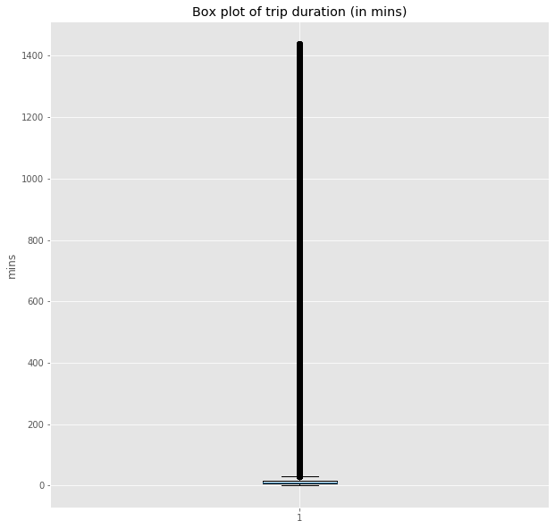


As suspected, there are outliers in the data, and these outliers are skewing our mean and median estimates. We remove all values that are outside the 95th percentile for `duration_min`. 


```python
outliers_removed = data[data['duration_min'] < data['duration_min'].quantile(.95)]
outliers_removed['duration_min'].describe()
```


    count    493714.000000
    mean         11.186364
    std           6.798796
    min           1.016667
    25%           6.200000
    50%           9.533333
    75%          14.433333
    max          37.300000
    Name: duration_min, dtype: float64


```python
plt.figure(figsize=(10, 10))
plt.boxplot(outliers_removed['duration_min'])
plt.title('Box plot of trip duration (in mins) -- outliers removed')
plt.xlabel('')
plt.ylabel('mins')
plt.show()
```


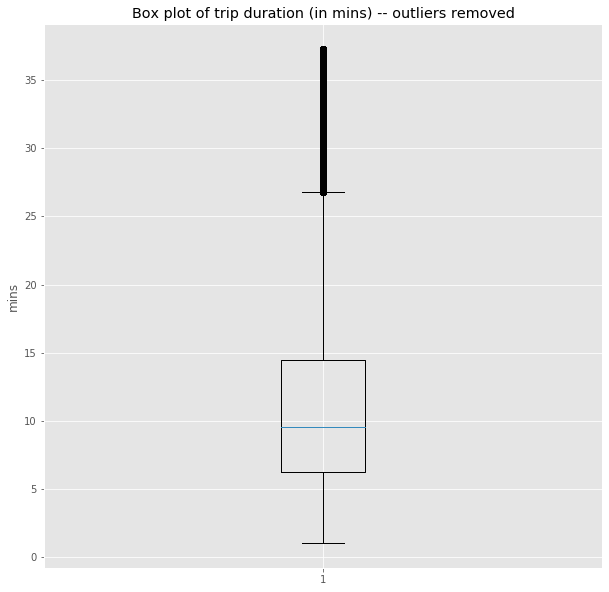


There still are outliers, but at least the means and modes are more reflective of the data. We plot a histogram of `duration_min` to see if we need to further splice the data.


```python
plt.figure(figsize=(20, 8))

plt.hist(outliers_removed['duration_min'], bins = 80, color='#3396FF')
plt.title('Histogram of trip duration (in min)')
plt.ylabel('Number of rides')
plt.xlabel('Trip duration (in mins)')
plt.show()
```


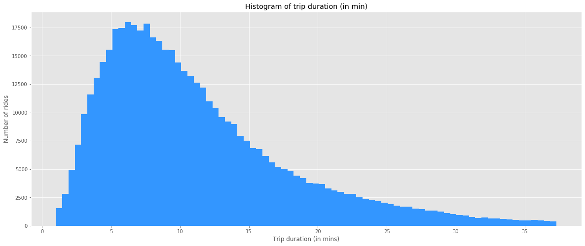


The data is right-skewed, but doesn't seem to contain too many drastic outliers. A max trip duration of ~40 minutes seems plausible. 

Moving on: we count the number of NaNs in the sample...


```python
outliers_removed.isna().sum()
```


    duration_sec                   0
    start_time                     0
    end_time                       0
    start_station_id               0
    start_station_name             0
    start_station_latitude         0
    start_station_longitude        0
    end_station_id                 0
    end_station_name               0
    end_station_latitude           0
    end_station_longitude          0
    bike_id                        0
    user_type                      0
    member_birth_year          50996
    member_gender              50917
    start_day_of_week              0
    start_date                     0
    end_date                       0
    duration_min                   0
    dtype: int64


```python
outliers_removed.dropna(inplace=True)
outliers_removed.isna().sum().sum()
```

    /Users/chan/anaconda3/lib/python3.7/site-packages/ipykernel_launcher.py:1: SettingWithCopyWarning: 
    A value is trying to be set on a copy of a slice from a DataFrame
    
    See the caveats in the documentation: http://pandas.pydata.org/pandas-docs/stable/indexing.html#indexing-view-versus-copy
      """Entry point for launching an IPython kernel.


    0


...and drop all NaN rows. 

Finally, we box-plot the `member_birth_year` to make sure data doesn't have anomalous values. Before that, we create a `member_age` column to more intuitively understand the age.


```python
outliers_removed['member_age'] = 2019 - outliers_removed['member_birth_year']

plt.figure(figsize=(5, 5))
plt.boxplot(outliers_removed['member_age'])
plt.title('Box plot of member ages')
plt.xlabel('')
plt.ylabel('years')
plt.show()
```

    /Users/chan/anaconda3/lib/python3.7/site-packages/ipykernel_launcher.py:1: SettingWithCopyWarning: 
    A value is trying to be set on a copy of a slice from a DataFrame.
    Try using .loc[row_indexer,col_indexer] = value instead
    
    See the caveats in the documentation: http://pandas.pydata.org/pandas-docs/stable/indexing.html#indexing-view-versus-copy
      """Entry point for launching an IPython kernel.


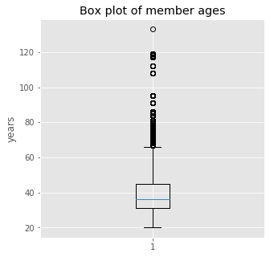


Clearly, outliers exist. We remove all people above the age of 90. 


```python
outliers_removed = outliers_removed.loc[outliers_removed['member_age'] < 90]
outliers_removed['member_age'].describe()
```


    count    442246.000000
    mean         38.513205
    std          10.197904
    min          20.000000
    25%          31.000000
    50%          36.000000
    75%          45.000000
    max          86.000000
    Name: member_age, dtype: float64


```python
plt.figure(figsize=(5, 5))
plt.boxplot(outliers_removed['member_age'])
plt.title('Box plot of member ages -- outliers above the age of 90 removed')
plt.xlabel('')
plt.ylabel('years')
plt.ylim(0, 100)
plt.show()
```


Everything looks good. We can proceed with EDA.

## EDA 

### Gender composition of sample

Since we're interested in the demographics of the bikers, we group by `member_gender`.


```python
gender_groupby = pd.Series.to_frame(outliers_removed.groupby(by=['member_gender']).size())
gender_groupby.rename(columns={0:'count'}, inplace=True)
gender_groupby
```


<div>
<style scoped>
    .dataframe tbody tr th:only-of-type {
        vertical-align: middle;
    }

    .dataframe tbody tr th {
        vertical-align: top;
    }

    .dataframe thead th {
        text-align: right;
    }
</style>
<table border="1" class="dataframe">
  <thead>
    <tr style="text-align: right;">
      <th></th>
      <th>count</th>
    </tr>
    <tr>
      <th>member_gender</th>
      <th></th>
    </tr>
  </thead>
  <tbody>
    <tr>
      <th>Female</th>
      <td>95088</td>
    </tr>
    <tr>
      <th>Male</th>
      <td>341203</td>
    </tr>
    <tr>
      <th>Other</th>
      <td>5955</td>
    </tr>
  </tbody>
</table>
</div>


And this gender-composition can be better represented by a pie chart. 


```python
plt.figure(figsize=(5, 5))
plt.pie(x = gender_groupby['count'], labels=gender_groupby.index, autopct='%1.1f%%')
plt.show()
```


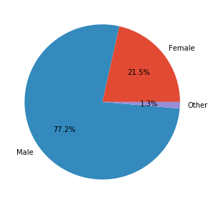


Since it comprises less than 2% of our results, we will omit the 'Other' category for convenience in analysis.


```python
male_cust = outliers_removed.loc[outliers_removed['member_gender'] == 'Male']
female_cust = outliers_removed.loc[outliers_removed['member_gender'] == 'Female']
```

### Comparing trip duration across gender groups


```python
plt.figure(figsize=(20, 8))

plt.hist(male_cust['duration_min'], bins=150, density=True, color=GREEN, alpha=0.5)
plt.hist(female_cust['duration_min'], bins=150, density=True, color=PURPLE, alpha=0.5)
plt.title("Distribution of trip duration (in mins) across gender groups")
plt.xlabel("trip duration (in mins)")
plt.ylabel("frequency")
plt.xticks(ticks=range(0, 40, 2))
plt.legend()

plt.show()
```

    No handles with labels found to put in legend.


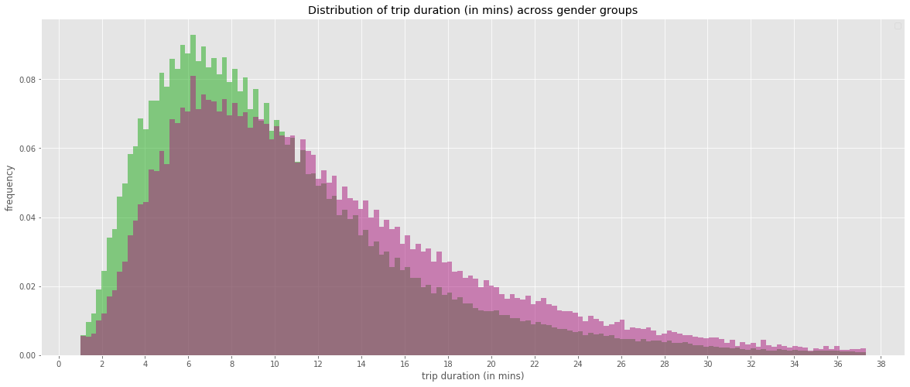


We notice that the mode for the average trip distance for male customers is a little shorter than the female customers.  


```python
print("The mode for female customers is {}".format(female_cust['duration_min'].mode()))

print("The mode for male customers is {}".format(male_cust['duration_min'].mode()))

print("The difference is {}".format(female_cust['duration_min'].mode() - male_cust['duration_min'].mode()))

```

    The mode for female customers is 0    6.466667
    dtype: float64
    The mode for male customers is 0    5.95
    dtype: float64
    The difference is 0    0.516667
    dtype: float64


Unfortunately, I'm forced to conclude that the modal difference in trip duration is insignificant for advertising purposes. 

### Comparing member's age across gender groups


```python
plt.figure(figsize=(20, 8))

plt.hist(male_cust['member_age'], bins=60, density=True, color=GREEN, alpha=0.5)
plt.hist(female_cust['member_age'], bins=60, density=True, color=PURPLE, alpha=0.5)
plt.xticks(ticks=range(15, 100, 5))
plt.title("Distribution of member ages (in years) across gender groups")
plt.xlabel("member age (in years)")
plt.ylabel("frequency")
plt.legend()

plt.show()
```

    No handles with labels found to put in legend.


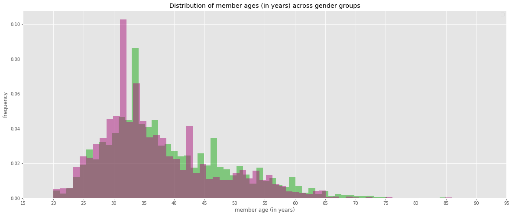


Even though there seems to be a modal difference between the two gender groups, it is practically insignificant for advertising purposes, i.e, 31 year olds are very similar to 34 year olds. 

### Identifying most popular stations by gender groups

The rationale behind this exploration is that male customers (which form 75% of the user base) might alight/depart at different stations than women, and as such, might offer **insight into the reasons** they're using the service (eg. last mile commuting, vs. recreation, etc.).


```python
male1 = pd.Series.to_frame(male_cust['start_station_name'].value_counts())
male1.rename_axis('station', inplace = True)

male2 = pd.Series.to_frame(male_cust['end_station_name'].value_counts())
male2.rename_axis('station', inplace = True)

male_endpoints = pd.concat([male1, male2], axis=1, sort=False)
male_endpoints.rename(
    columns={'start_station_name': 'male_start_station_name', 'end_station_name':'male_end_station_name' },
    inplace=True)

male_endpoints.fillna(0, inplace=True)
male_endpoints['male_total'] = male_endpoints['male_start_station_name'] + male_endpoints['male_end_station_name']
male_endpoints['percent_of_total_m'] = male_endpoints['male_total']/sum(male_endpoints['male_total'])
male_endpoints.sort_values(by='male_total', inplace=True, ascending=False)

male_endpoints[:15].plot.bar(
    figsize=(20, 8), 
    title="Endpoint frequency in male customers (top 15 stations)")
```


    <matplotlib.axes._subplots.AxesSubplot at 0x15219cf28>


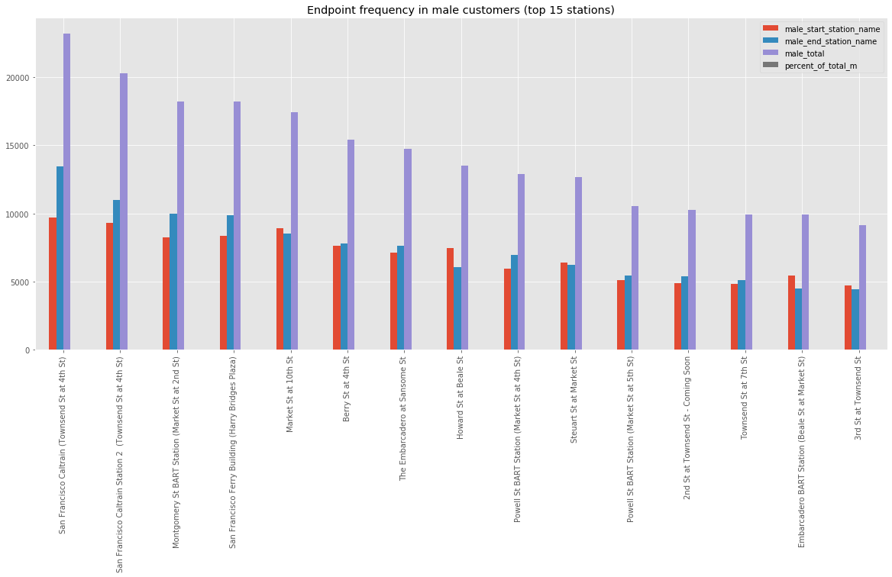


```python
female1 = pd.Series.to_frame(female_cust['start_station_name'].value_counts())
female1.rename_axis('station', inplace = True)

female2 = pd.Series.to_frame(female_cust['end_station_name'].value_counts())
female2.rename_axis('station', inplace = True)

female_endpoints = pd.concat([female1, female2], axis=1, sort=False)
female_endpoints.rename(
    columns={'start_station_name': 'female_start_station_name', 'end_station_name':'female_end_station_name' },
    inplace=True)

female_endpoints.fillna(0, inplace=True)
female_endpoints['female_total'] = female_endpoints['female_start_station_name'] + female_endpoints['female_end_station_name']
female_endpoints['percent_of_total_f'] = female_endpoints['female_total']/sum(female_endpoints['female_total'])
female_endpoints.sort_values(by='female_total', inplace=True, ascending=False)

female_endpoints[:15].plot.bar(figsize=(20, 8), title="Endpoint frequency in female customers (top 15 stations)")
```


    <matplotlib.axes._subplots.AxesSubplot at 0x15144b198>


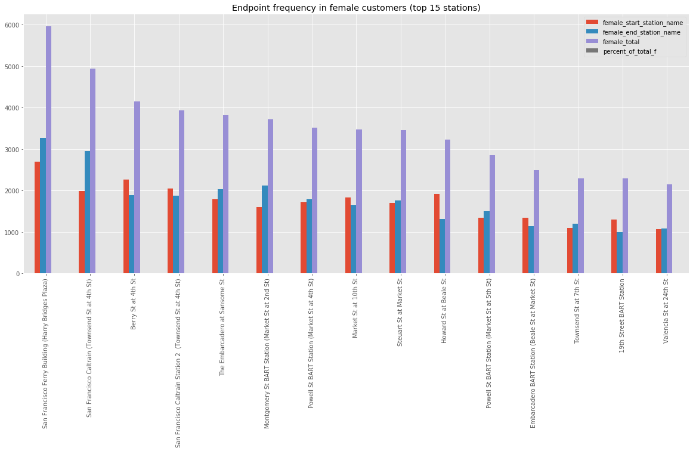


Clearly, there's something of note here. The top 5 stations for male customers are not shared by female customers. 


```python
male_endpoints.head(8)
```


<div>
<style scoped>
    .dataframe tbody tr th:only-of-type {
        vertical-align: middle;
    }

    .dataframe tbody tr th {
        vertical-align: top;
    }

    .dataframe thead th {
        text-align: right;
    }
</style>
<table border="1" class="dataframe">
  <thead>
    <tr style="text-align: right;">
      <th></th>
      <th>male_start_station_name</th>
      <th>male_end_station_name</th>
      <th>male_total</th>
      <th>percent_of_total_m</th>
    </tr>
  </thead>
  <tbody>
    <tr>
      <th>San Francisco Caltrain (Townsend St at 4th St)</th>
      <td>9719</td>
      <td>13483</td>
      <td>23202</td>
      <td>0.034000</td>
    </tr>
    <tr>
      <th>San Francisco Caltrain Station 2  (Townsend St at 4th St)</th>
      <td>9290</td>
      <td>10985</td>
      <td>20275</td>
      <td>0.029711</td>
    </tr>
    <tr>
      <th>Montgomery St BART Station (Market St at 2nd St)</th>
      <td>8260</td>
      <td>9980</td>
      <td>18240</td>
      <td>0.026729</td>
    </tr>
    <tr>
      <th>San Francisco Ferry Building (Harry Bridges Plaza)</th>
      <td>8362</td>
      <td>9858</td>
      <td>18220</td>
      <td>0.026700</td>
    </tr>
    <tr>
      <th>Market St at 10th St</th>
      <td>8904</td>
      <td>8543</td>
      <td>17447</td>
      <td>0.025567</td>
    </tr>
    <tr>
      <th>Berry St at 4th St</th>
      <td>7657</td>
      <td>7786</td>
      <td>15443</td>
      <td>0.022630</td>
    </tr>
    <tr>
      <th>The Embarcadero at Sansome St</th>
      <td>7131</td>
      <td>7606</td>
      <td>14737</td>
      <td>0.021596</td>
    </tr>
    <tr>
      <th>Howard St at Beale St</th>
      <td>7451</td>
      <td>6083</td>
      <td>13534</td>
      <td>0.019833</td>
    </tr>
  </tbody>
</table>
</div>


```python
female_endpoints.head(8)
```


<div>
<style scoped>
    .dataframe tbody tr th:only-of-type {
        vertical-align: middle;
    }

    .dataframe tbody tr th {
        vertical-align: top;
    }

    .dataframe thead th {
        text-align: right;
    }
</style>
<table border="1" class="dataframe">
  <thead>
    <tr style="text-align: right;">
      <th></th>
      <th>female_start_station_name</th>
      <th>female_end_station_name</th>
      <th>female_total</th>
      <th>percent_of_total_f</th>
    </tr>
  </thead>
  <tbody>
    <tr>
      <th>San Francisco Ferry Building (Harry Bridges Plaza)</th>
      <td>2689</td>
      <td>3273.0</td>
      <td>5962.0</td>
      <td>0.031350</td>
    </tr>
    <tr>
      <th>San Francisco Caltrain (Townsend St at 4th St)</th>
      <td>1988</td>
      <td>2956.0</td>
      <td>4944.0</td>
      <td>0.025997</td>
    </tr>
    <tr>
      <th>Berry St at 4th St</th>
      <td>2256</td>
      <td>1895.0</td>
      <td>4151.0</td>
      <td>0.021827</td>
    </tr>
    <tr>
      <th>San Francisco Caltrain Station 2  (Townsend St at 4th St)</th>
      <td>2053</td>
      <td>1875.0</td>
      <td>3928.0</td>
      <td>0.020655</td>
    </tr>
    <tr>
      <th>The Embarcadero at Sansome St</th>
      <td>1784</td>
      <td>2037.0</td>
      <td>3821.0</td>
      <td>0.020092</td>
    </tr>
    <tr>
      <th>Montgomery St BART Station (Market St at 2nd St)</th>
      <td>1596</td>
      <td>2116.0</td>
      <td>3712.0</td>
      <td>0.019519</td>
    </tr>
    <tr>
      <th>Powell St BART Station (Market St at 4th St)</th>
      <td>1720</td>
      <td>1790.0</td>
      <td>3510.0</td>
      <td>0.018457</td>
    </tr>
    <tr>
      <th>Market St at 10th St</th>
      <td>1833</td>
      <td>1638.0</td>
      <td>3471.0</td>
      <td>0.018252</td>
    </tr>
  </tbody>
</table>
</div>


This opens up avenues for targeted advertising. The Caltrain stops reflect a different mode switch (namely, the Caltrain) than the BART Stations at Market St and Berry St. Lastly, the Embarcadero and Ferry Building could represent tourist/recreational traffic as well. This needs to be validated with UX research, but at least the data backs it up.


```python
# Endpoints dataframe in case we need to map entire traffic density. 

endpoints = pd.concat([male_endpoints, female_endpoints], axis=1, sort=False)
endpoints['total_both_genders'] = endpoints['male_total'] + endpoints['female_total']
endpoints.sort_values(by='total_both_genders', ascending=False)

endpoints['total_both_genders'][:20].plot(
    kind='bar', figsize=(20, 8), 
    title="All trips through stations for both gender groups (top 20)",
    color=PURPLE)

```


    <matplotlib.axes._subplots.AxesSubplot at 0x154febf98>


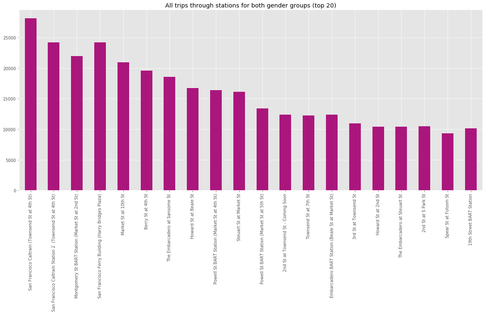


### Temporal analysis of trip data

We examine the datetime data to see if we can isolate any useful temporal data.


```python
plt.figure(figsize=(20, 8))

plt.subplot(2, 1, 1)
plt.hist(male_cust['start_time'], bins=576, density=True, color=GREEN, alpha=0.5)
plt.hist(female_cust['start_time'], bins=576, density=True, color=PURPLE, alpha=0.5)
plt.title("Distribution of trips across the day")
plt.xlabel("Time of day")
plt.xticks([str(x) + ":00" for x in range(0, 24, 1)])

plt.subplots_adjust(hspace = 0.5)

plt.subplot(2, 1, 2)
plt.hist(male_cust['start_date'], bins=50, density=True, color=GREEN, alpha=0.5)
plt.hist(female_cust['start_date'], bins=50, density=True, color=PURPLE, alpha=0.5)
plt.title("Distribution of trips across the range of dates (07/17 - 01/18)")
plt.xlabel("Dates")

plt.show()
```


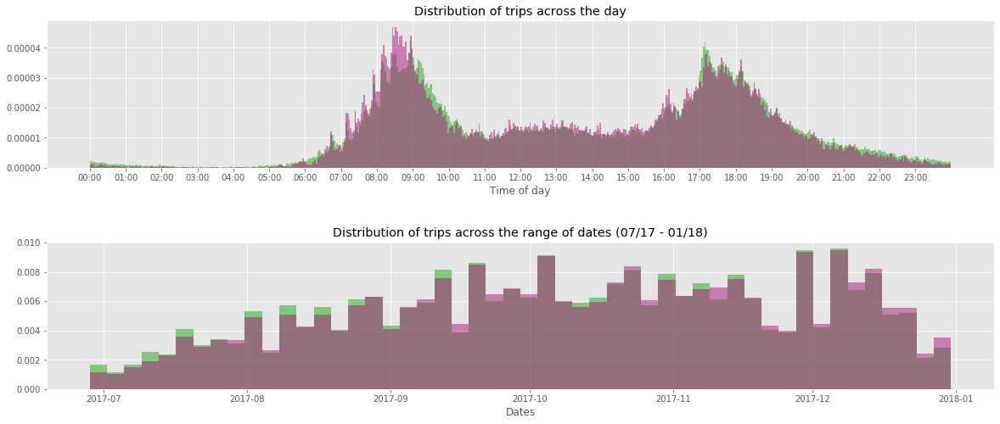


The date range distribution isn't too helpful without supporting data (weather, etc.), but it's worth exploring the bimodal time distribution.

There are two modes: an early morning rush from 8am - 9am, and an evening rush between 5pm and 6pm. It's safe to assume that these reflect the work rush hours, and people are primarily using the bikes to get to central transit hubs. This offers us some insight into what could be on the advertising copy.

Lastly, we plot the distribution of trips across the days of the week, to see if any particular trend is observed.


```python
day_of_week_groupby = pd.Series.to_frame(outliers_removed.groupby(by=['start_day_of_week']).size())
day_of_week_groupby.rename(columns={0:'count'}, inplace=True)
day_of_week_groupby.plot(kind='bar')
plt.show()
```


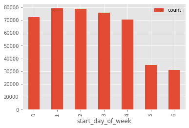


Unfortunately, no particularly surprising insight here. This just confirms that the bikes are primarily being used during the week, and corroborates our theory that customers use it for mode transfer/last-mile transport.

## Insights and recommendations 

The key insight was that different end/start stations are preferred by different gender groups. As such, I recommend that print ads be placed around various popular starting stations that suggest the respective gender group take the trip to the popular end stations.

Eg. The San Francisco Ferry Building is a particularly popular destination for female travelers. Therefore, ads must be placed around nearby `start_stations` with a female traveler with copy along the lines of "The journey to the Ferry Building is as pretty as the building itself. Why not enjoy the ride on a bike?"


```python

```
